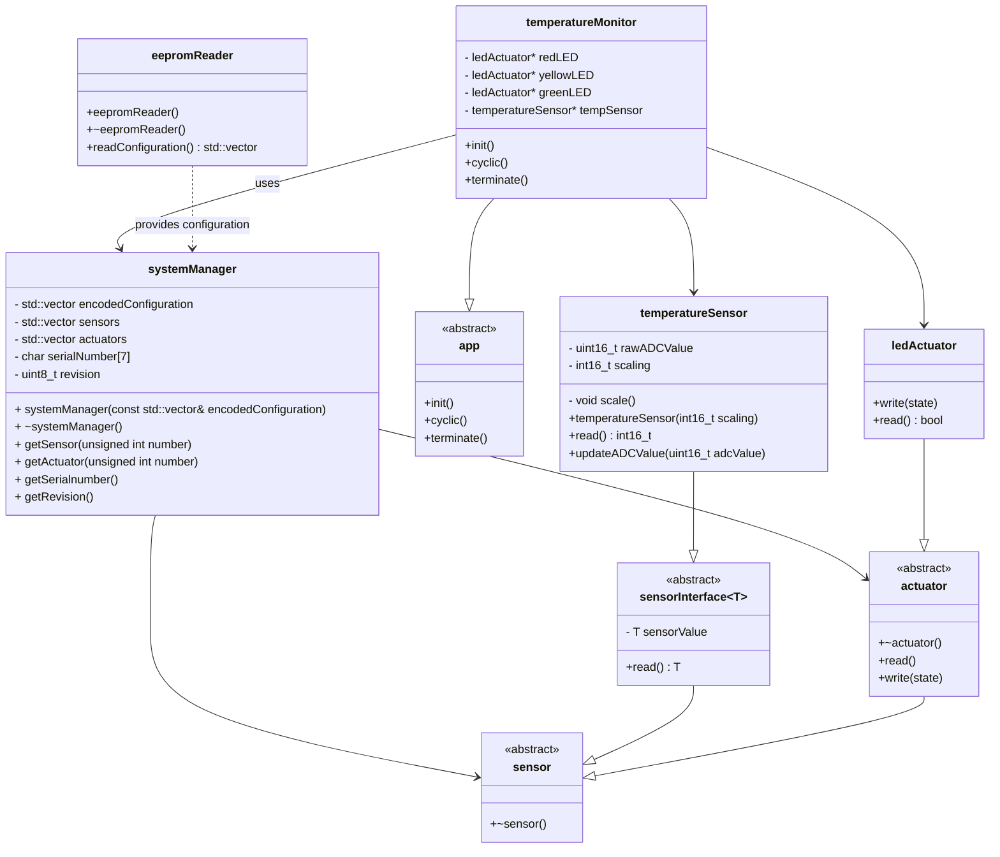

\thispagestyle{empty}

```mermaid
classDiagram
    class systemManager {
        - std::vector<uint8_t> encodedConfiguration
        - std::vector<sensor*> sensors
        - std::vector<actuator*> actuators
        - char serialNumber[7]
        - uint8_t revision
        + systemManager(const std::vector<uint8_t>& encodedConfiguration)
        + ~systemManager()
        + getSensor(unsigned int number)
        + getActuator(unsigned int number)
        + getSerialnumber()
        + getRevision()
    }

    class app {
        <<abstract>>
        +init()
        +cyclic()
        +terminate()
    }

    class sensor {
        <<abstract>>
        +~sensor()
    }

    class sensorInterface~T~ {
        <<abstract>>
        - T sensorValue
        +read() T
    }

    class temperatureSensor {
        - uint16_t rawADCValue
        - int16_t scaling
        - void scale()
        +temperatureSensor(int16_t scaling)
        +read() int16_t
        +updateADCValue(uint16_t adcValue)
    }

    class actuator {
        <<abstract>>
        +~actuator()
        +read()
        +write(state)
    }

    class ledActuator {
        +write(state)
        +read() bool
    }

    class temperatureMonitor {
        - ledActuator* redLED
        - ledActuator* yellowLED
        - ledActuator* greenLED
        - temperatureSensor* tempSensor
        +init()
        +cyclic()
        +terminate()
    }

    class eepromReader {
        +eepromReader()
        +~eepromReader()
        +readConfiguration() std::vector<uint8_t>
    }

    systemManager --> sensor
    systemManager --> actuator
    sensorInterface~T~ --|> sensor
    temperatureSensor --|> sensorInterface~int16_t~
    actuator --|> sensor
    ledActuator --|> actuator
    temperatureMonitor --|> app
    temperatureMonitor --> ledActuator
    temperatureMonitor --> temperatureSensor
    temperatureMonitor --> systemManager : uses
    eepromReader ..> systemManager : provides configuration
```